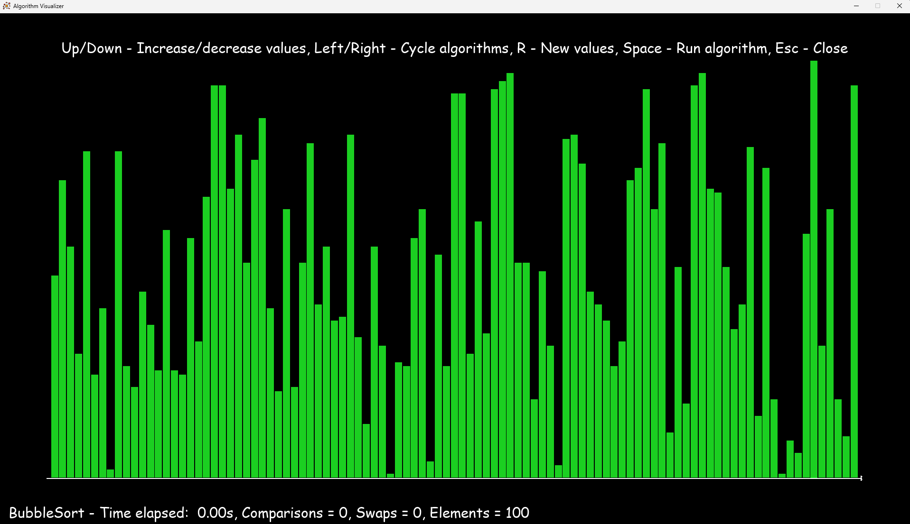
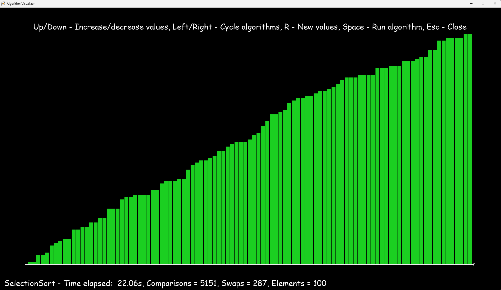

# Sorting Algorithm Visualiser

A python application showcasing how different sorting algorithms perform and sort datasets visually.
Supported sorting algorithms include bubble sort, selection sort, heap sort, insertion sort, merge sort and quick sort.
Running an algorithm sort will display the time taken to sort the data and the number of comparisons evaluated on each iteration.

# Prerequisites

- Python 3.13.1

# Build

- Clone this repo > `git clone https://github.com/TravisF82/Sorting-Algorithm-Visualiser.git`

- Create virtual environment > `python -m venv .venv`

- Activate venv > `.venv\Scripts\activate`

- Install dependencies > `pip install -r requirements.txt`

# Run

- Terminal > `python main.py`

# Demo

